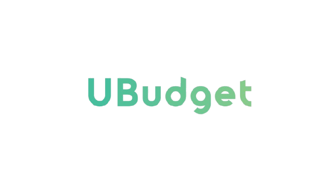

# 💰 UBudget

## 👥 Grupo  
**Buitrago**   

## 📧 Miembros y contacto   

- **Nicolás Andrés Castellanos Rico** -  ncastellanosr@unal.edu.co
- **Erfán Andrés Triana Duque** -  etrianad@unal.edu.co
- **Juan David Yopasa Maldonado** -  jyopasam@unal.edu.co
- **Juan Felipe Quiroga Medina** -  juquirogam@unal.edu.co

## 📖 Descripción del proyecto 
El mundo de las finanzas es un ámbito extenso y lleno de detalles, lo cual puede resultar abrumador. Todos sabemos la importancia de gestionar nuestras finanzas, ahorrar e invertir, pero la verdadera pregunta es: ¿cómo lograrlo de manera efectiva? Para responder a esta necesidad, presentamos UBudget, una plataforma que guía al usuario paso a paso en la mejora de sus finanzas personales. Porque lo que no se mide, no se puede mejorar, con UBudget puedes visualizar rápidamente tu estado financiero, monitorear ingresos y gastos, y recibir consejos personalizados para incrementar tus ingresos, optimizar tus ahorros e invertir inteligentemente.

## Llaves y ubicación:
[Credenciales:](https://drive.google.com/drive/folders/1ZUA0eVKRapssy8NIm_-seKcnWgBplrQH?usp=drive_link)
Ubicación:
- *MySQL:* Buitrago/
- *Front:* Buitrago/Proyecto/
- *Back:* Buitrago/Proyecto/Backend/

## 🖼️ Logo

